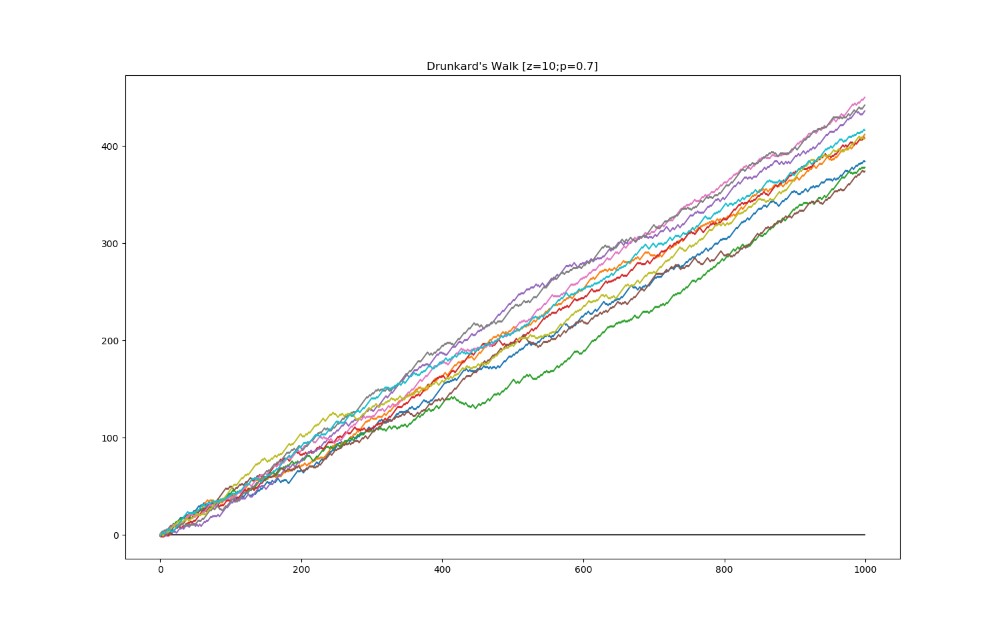

# Drunkard's Walk
_I'm not drunk, I swear!_

---

## About

One dimensional random walk. Imagine a drunken person walking down the street. 

## Results

_32 drunkards, 50% chance of making a step forward, 1000 steps_

_10 drunkards, 70% chance of making a step forward, 1000 steps_

---

... Matthias M. (November, 2019)